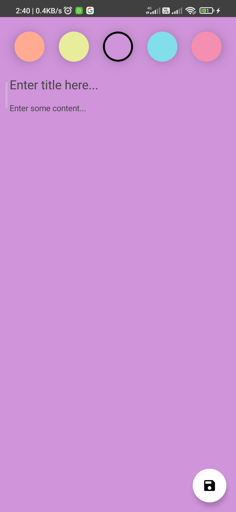
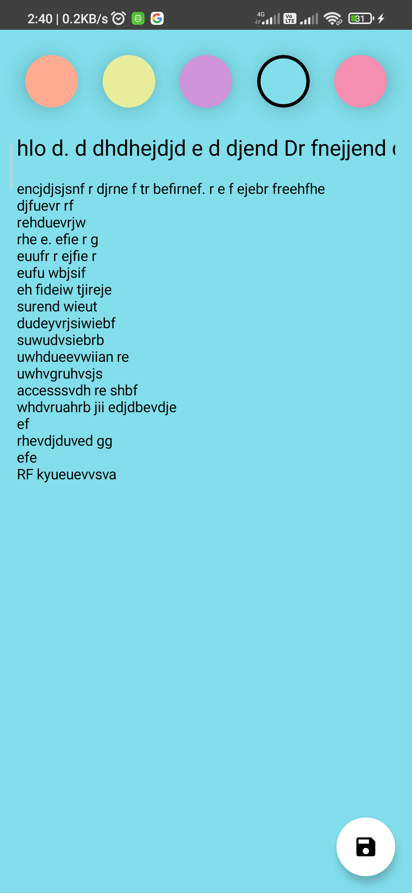
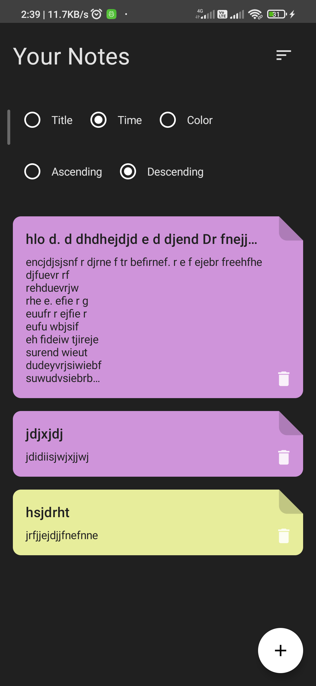

# Take-Note

## A simple note taking app

It is a simple note taking app which uses local database to save the notes into persistent storage.

## Screenshots

  
   
  

### Library Used

- Jetpack Compose
- Room
- Dagger-Hilt
- Kotlin-Coroutines

> Feel Free to use it
